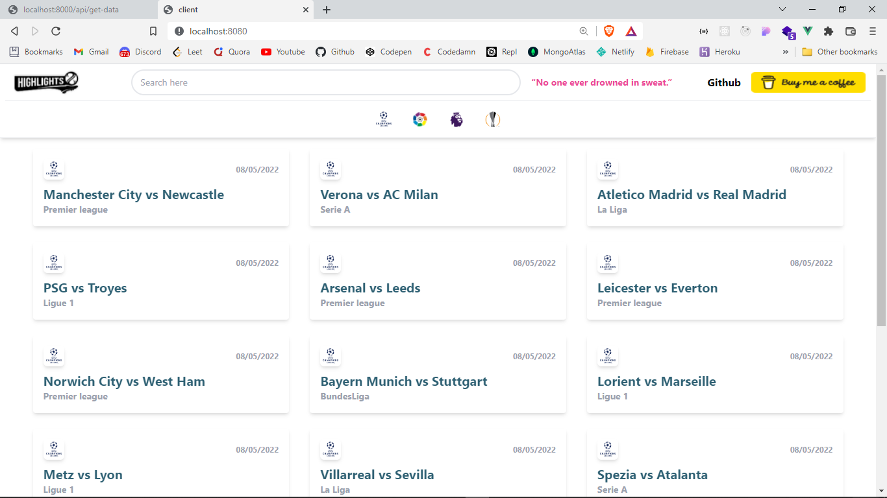

# Football Highights

## Badges


This is a [Vue.js](https://vuejs.org/) project.
Backend is created using Scrapping of website https://hoofoot.com/ using cheerio.
Frontend is created using Vuejs.

## Getting Started

First, run the development server:

```bash
cd client
npm install
vue serve
```

```bash
cd server
npm run dev
```

## Screenshots




